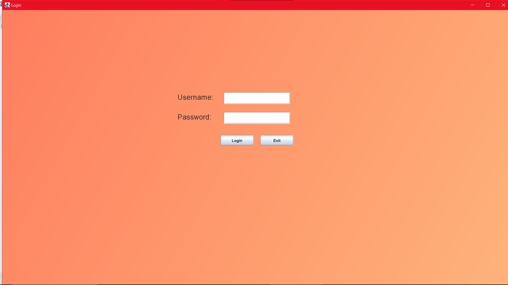
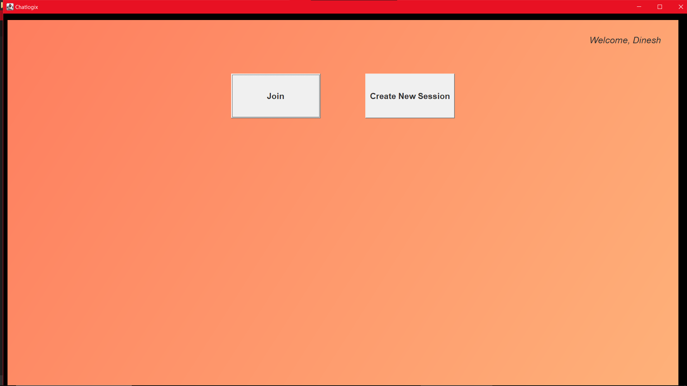
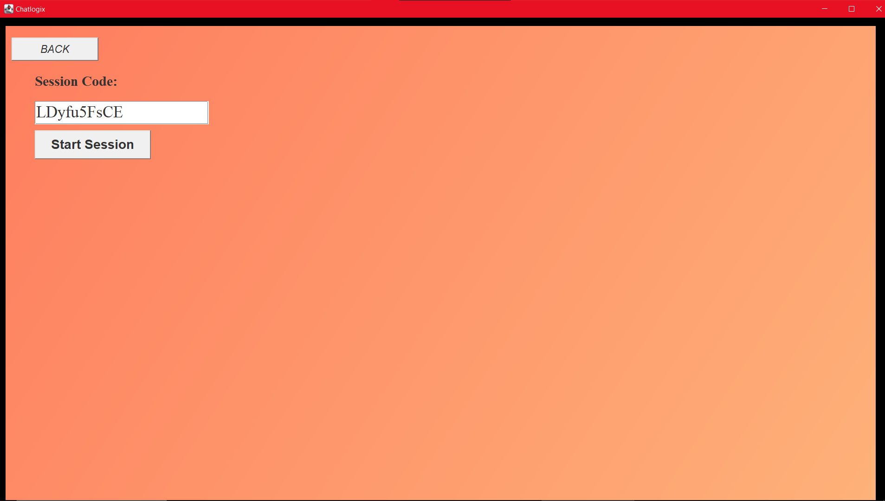
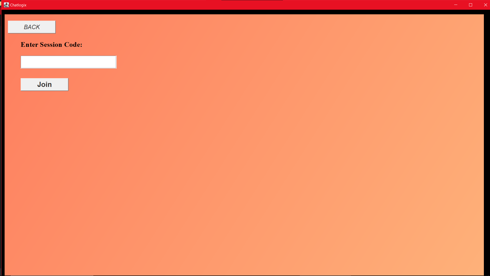
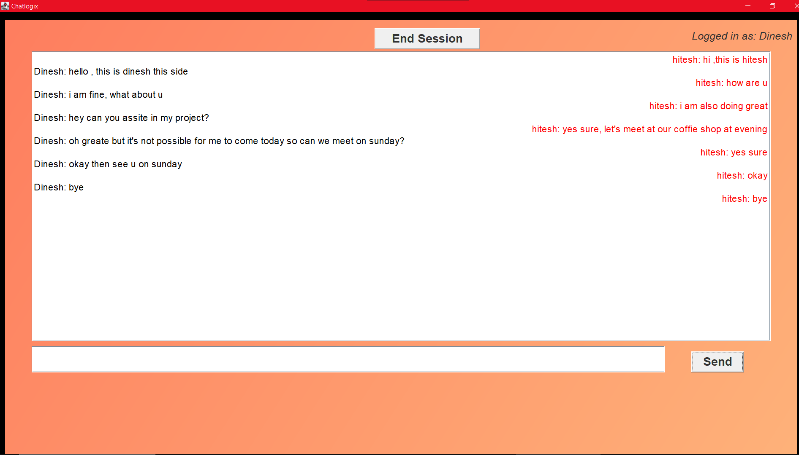
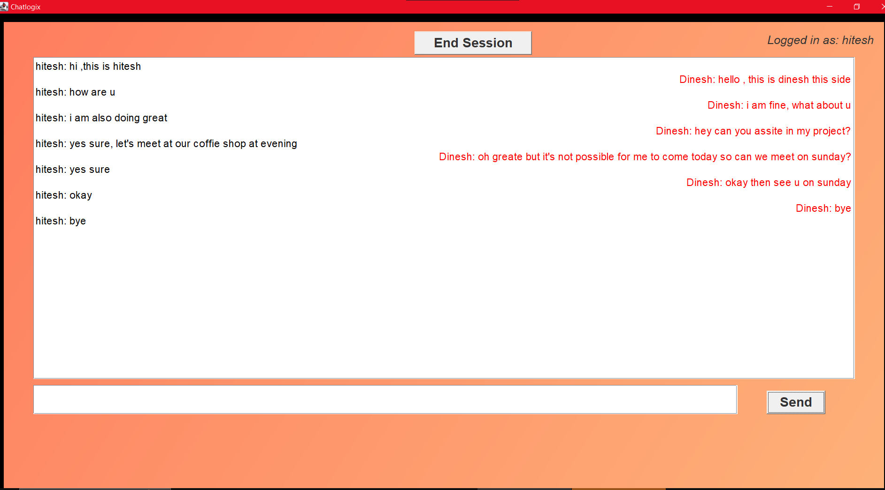

<div align="center">
<h1><b> Chatlogix </b></h1>
  
  
  
  
 

</div>

---
**Chatlogix** is a desktop-based chat application built in Java using Swing. It supports real-time messaging, session-based communication, and user authentication via MySQL. The UI is styled with gradients and includes session management  features.

---

## Features

-  User login with MySQL database
-  Real-time messaging using sockets
-  Session-based chat with session codes
-  Gradient-styled Swing interface
-  Clean architecture with modular components
- Environment-based configuration (`.env` support)

---

##  Project Structure
```
Chatlogix/
├── Chatlogix.java # Main application (GUI + client logic)
├── ChatServer.java # Socket-based chat server
├── EnvLoader.java # Utility to read DB credentials from .env
├── chatlogix.sql # SQL script to create DB and tables
├── .env #   local database credentials
```
---


###  System Requirements
- Java JDK 8 or higher
- MySQL Server (can be via WAMP, XAMPP, or native install)
- Terminal or IDE (Eclipse/VS Code)

###  Libraries Needed
- MySQL JDBC Driver (`mysql-connector-java.jar`) must be in classpath
- `EnvLoader.java` (provided in project) to load `.env` file

---
##  Application Screenshots

| Login Screen | Home Screen | Create Session | Join Session |
|--------------|-------------|----------------|--------------|
|  |  |  |  |

| User 1 Chat | User 2 Chat |
|-------------|-------------|
|  |  |

##  Environment Configuration

Create a `.env` file in your root directory with the following:
```
DB_URL=jdbc:mysql://localhost:3306/chatlogix
DB_USER=root
DB_PASSWORD=yourpassword
```
---

##  Database Setup

1. Ensure MySQL server is running (WAMP, XAMPP, or standalone).
2. Import the SQL setup script:

```bash
mysql -u root -p < chatlogix.sql
```
Or use phpMyAdmin or MySQL Workbench to run the script manually.

---
 ## How to Start the Application
1. **Run `ChatServer.java`**
   - Wait for the message: *Server started on port 8080*

2. **Run `Chatlogix.java`**
   - a. Log in using a valid user account from the database  
   - b. Click **Create** to generate a new chat session code  
   - c. Open a second `Chatlogix` window and click **Join**, entering the same session code  
   - d. Start chatting!
